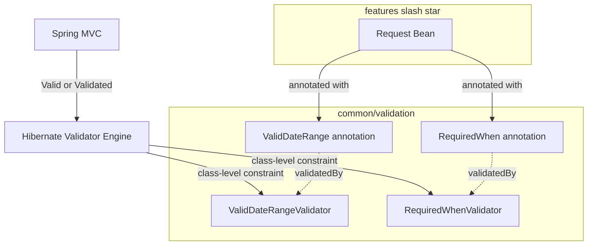
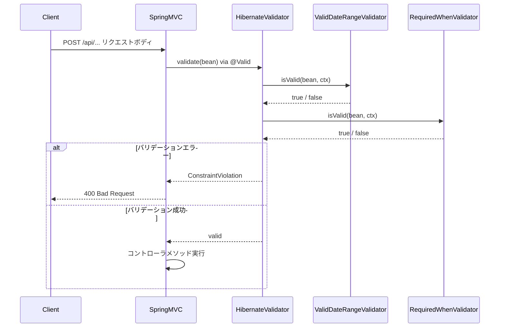

# 技術設計書

## 概要

本設計は、Spring Boot アプリケーションに2つの相関バリデーション部品を追加する。Jakarta Bean Validation の `ConstraintValidator` をクラスレベルで実装し、フィールド間の検証ルールを宣言的かつ再利用可能な形で表現する。

**目的**: 開発者が複数フィールド間のバリデーションロジックをアノテーションで宣言し、既存の Spring MVC バリデーションフローと追加設定なしに統合できるようにする。
**対象ユーザー**: APIリクエストのフォームバリデーションを実装する開発者。
**影響**: 既存コードへの変更なし。`common/validation` パッケージに4クラスを新設するのみ。

### Goals

- `@ValidDateRange` — `uuuu/MM/dd` 形式の日付文字列2フィールド間の前後関係を検証するクラスレベルアノテーションを提供する
- `@RequiredWhen` — 依存フィールドに値がある場合の条件付き必須チェックを行うクラスレベルアノテーションを提供する
- Jakarta Bean Validation 3.0 / Hibernate Validator 8.x との完全な互換性を保つ

### Non-Goals

- `String` 以外の型（`LocalDate`、`Integer` 等）への直接対応
- 3フィールド以上のネストした依存関係
- Spring AOP を使ったバリデーション処理のインターセプト

## 要件トレーサビリティ

| 要件 | 概要 | コンポーネント | インタフェース |
|---|---|---|---|
| 1.1 | from ≤ to を確認 | ValidDateRangeValidator | isValid |
| 1.2 | from > to でエラー返却 | ValidDateRangeValidator | isValid |
| 1.3 | null/空文字でチェックスキップ | ValidDateRangeValidator | isValid |
| 1.4 | uuuu/MM/dd フォーマットでパース | ValidDateRangeValidator | isValid |
| 1.5 | 不正フォーマットでエラー返却 | ValidDateRangeValidator | isValid |
| 1.6 | from/to 属性でフィールド名指定 | @ValidDateRange | from(), to() |
| 1.7 | クラスレベルアノテーションとして適用 | @ValidDateRange | @Target(TYPE) |
| 2.1 | dependsOn フィールド存在確認 | RequiredWhenValidator | isValid |
| 2.2 | 依存フィールドあり＋対象フィールドなし → エラー | RequiredWhenValidator | isValid |
| 2.3 | 依存フィールドなし → スキップ | RequiredWhenValidator | isValid |
| 2.4 | String型フィールドへの適用 | @RequiredWhen | field 属性 |
| 2.5 | dependsOn 属性でフィールド名指定 | @RequiredWhen | dependsOn() |
| 3.1 | ConstraintValidator 実装 | ValidDateRangeValidator, RequiredWhenValidator | ConstraintValidator |
| 3.2 | @Valid/@Validated との連携 | Hibernate Validator（組み込み） | — |
| 3.3 | message 属性サポート | @ValidDateRange, @RequiredWhen | message() |
| 3.4 | ConstraintViolation 生成 | ValidDateRangeValidator, RequiredWhenValidator | isValid |

## アーキテクチャ

### 既存アーキテクチャの分析

- `spring-boot-starter-validation`（Hibernate Validator 8.x）が pom.xml に既存 → 追加ライブラリ不要
- フィーチャーファーストパッケージ構成。横断的関心事は `common` パッケージへ（steering: structure.md）
- 既存コードに `common` パッケージなし → 今回新設する

### Architecture Pattern & Boundary Map



- **選択パターン**: Jakarta Bean Validation クラスレベル制約（標準推奨パターン）
- **新規コンポーネント**: `common/validation` パッケージ（4クラス）
- **既存パターン維持**: フィーチャーファーストパッケージ構成
- **Steering 準拠**: structure.md「横断的な共通処理のみ common または shared パッケージへ」方針に従う

### Technology Stack

| レイヤー | 選択 / バージョン | 役割 | 備考 |
|---|---|---|---|
| Backend | Java 21 | 実装言語 | リフレクション API 使用 |
| Validation | Hibernate Validator 8.x（Spring Boot 3.5.11 同梱） | ConstraintValidator 実行エンジン | 追加依存なし |
| Build | Maven Wrapper（既存） | ビルド・テスト・検証 | 変更なし |

## System Flows



**設計上の決定**: クラスレベル制約のバリデーションエラーはデフォルトでクラス自体に紐付く。クライアント向けのフィールドエラーとして表示するため、`ConstraintValidatorContext` の `addPropertyNode` API を使い、違反を対象フィールドに関連付ける。

## コンポーネントとインタフェース

| コンポーネント | ドメイン/レイヤー | 目的 | 要件カバレッジ | 主要依存 |
|---|---|---|---|---|
| `@ValidDateRange` | common/validation | 日付範囲制約アノテーション | 1.6, 1.7, 3.3 | ValidDateRangeValidator (P0) |
| `ValidDateRangeValidator` | common/validation | 日付範囲バリデーションロジック | 1.1–1.5, 3.1, 3.4 | java.lang.reflect, java.time (P0) |
| `@RequiredWhen` | common/validation | 条件付き必須制約アノテーション | 2.4, 2.5, 3.3 | RequiredWhenValidator (P0) |
| `RequiredWhenValidator` | common/validation | 条件付き必須バリデーションロジック | 2.1–2.3, 3.1, 3.4 | java.lang.reflect (P0) |

### common/validation

#### @ValidDateRange

| フィールド | 内容 |
|---|---|
| Intent | 2つの日付フィールドの前後関係をクラスレベルで宣言する制約アノテーション |
| Requirements | 1.6, 1.7, 3.3 |

**Contracts**: Service [x]

##### アノテーション定義

```java
@Target(ElementType.TYPE)
@Retention(RetentionPolicy.RUNTIME)
@Constraint(validatedBy = ValidDateRangeValidator.class)
@Documented
public @interface ValidDateRange {
    String from();
    String to();
    String message() default "{com.example.api.common.validation.ValidDateRange.message}";
    Class<?>[] groups() default {};
    Class<? extends Payload>[] payload() default {};
}
```

- 前提条件: `from` と `to` に、対象クラスが保持する `String` 型フィールドの名前を指定すること
- 事後条件: `from ≤ to`（同日含む）であれば `isValid()` は `true` を返す
- 不変条件: アノテーション付与クラスは `from`/`to` で指定されたフィールドを保持すること

**実装ノート**
- `@Repeatable(ValidDateRange.List.class)` による複数指定をサポートする（同一クラスに複数日付範囲を定義可能）

---

#### ValidDateRangeValidator

| フィールド | 内容 |
|---|---|
| Intent | リフレクションで2フィールドの日付値を取得し、前後関係を検証する |
| Requirements | 1.1–1.5, 3.1, 3.4 |

**依存**
- 外部: `java.lang.reflect.Field` — フィールド値取得（P0）
- 外部: `java.time.LocalDate`, `java.time.format.DateTimeFormatter` — 日付パースと比較（P0）

**Contracts**: Service [x]

##### バリデーションロジック仕様

`isValid(Object bean, ConstraintValidatorContext ctx)` の動作:

1. `from` フィールド名、`to` フィールド名でリフレクションにより `String` 値を取得
2. どちらかが `null` または空文字列 → `true`（スキップ）を返す（要件 1.3）
3. `DateTimeFormatter.ofPattern("uuuu/MM/dd").withResolverStyle(ResolverStyle.STRICT)` で両値をパース
4. パース失敗（`DateTimeParseException`）→ `false`（要件 1.5）
5. `fromDate.isAfter(toDate)` → `false`（要件 1.2）
6. それ以外 → `true`（要件 1.1）

エラー時は `context.buildConstraintViolationWithTemplate(...)` `.addPropertyNode(toFieldName)` `.addConstraintViolation()` で `to` フィールドに違反を関連付ける（要件 3.4）。

- 前提条件: `bean` は `null` でないこと。指定フィールドが実際に存在すること。
- 事後条件: 仕様に従い `true` / `false` を返す
- フィールドが存在しない場合: `ValidationException` をスロー（フェイルファスト）

**実装ノート**
- `setAccessible(true)` を使用。プロジェクトはunnamed moduleのためJava 21のStrong Encapsulationの影響なし（詳細: `research.md`）
- `ResolverStyle.STRICT` を必須とし `2024/02/30` 等の存在しない日付を拒否する

---

#### @RequiredWhen

| フィールド | 内容 |
|---|---|
| Intent | 依存フィールドに値がある場合に別フィールドを必須とするクラスレベル制約アノテーション |
| Requirements | 2.4, 2.5, 3.3 |

**設計上の注意**: 要件 2.4 はフィールドレベル適用を示唆していたが、Jakarta Bean Validation のフィールドレベル `ConstraintValidator` は自身のフィールド値のみ受け取り、他フィールドへアクセスできない。このため **クラスレベルアノテーション** として再設計し、`field` 属性でバリデーション対象フィールドを、`dependsOn` 属性で依存フィールドを指定する。詳細は `research.md` 参照。

**Contracts**: Service [x]

##### アノテーション定義

```java
@Target(ElementType.TYPE)
@Retention(RetentionPolicy.RUNTIME)
@Constraint(validatedBy = RequiredWhenValidator.class)
@Documented
@Repeatable(RequiredWhen.List.class)
public @interface RequiredWhen {
    String field();
    String dependsOn();
    String message() default "{com.example.api.common.validation.RequiredWhen.message}";
    Class<?>[] groups() default {};
    Class<? extends Payload>[] payload() default {};

    @Target(ElementType.TYPE)
    @Retention(RetentionPolicy.RUNTIME)
    @Documented
    @interface List {
        RequiredWhen[] value();
    }
}
```

使用例:

```java
@RequiredWhen(field = "dateTo", dependsOn = "dateFrom")
public class Example {
    private String dateFrom;
    private String dateTo;
}
```

- 前提条件: `field` と `dependsOn` に、対象クラスが保持する `String` 型フィールドの名前を指定すること
- 事後条件: `dependsOn` が null/空の場合は `true`。`dependsOn` に値があり `field` が null/空なら `false`
- 不変条件: アノテーション付与クラスは `field`/`dependsOn` で指定されたフィールドを保持すること
- `@Repeatable` サポートにより、同一クラスへ複数の `@RequiredWhen` 指定が可能

---

#### RequiredWhenValidator

| フィールド | 内容 |
|---|---|
| Intent | リフレクションで2フィールドの値を取得し、条件付き必須チェックを行う |
| Requirements | 2.1–2.3, 3.1, 3.4 |

**依存**
- 外部: `java.lang.reflect.Field` — フィールド値取得（P0）

**Contracts**: Service [x]

##### バリデーションロジック仕様

`isValid(Object bean, ConstraintValidatorContext ctx)` の動作:

1. `dependsOn` フィールド名でリフレクションにより `String` 値を取得
2. `dependsOn` の値が `null` または空文字列 → `true`（スキップ）を返す（要件 2.3）
3. `field` フィールド名でリフレクションにより `String` 値を取得
4. `field` の値が `null` または空文字列 → `false`（要件 2.2）
5. それ以外 → `true`（要件 2.1）

エラー時は `context.buildConstraintViolationWithTemplate(...)` `.addPropertyNode(fieldName)` `.addConstraintViolation()` で `field` フィールドに違反を関連付ける（要件 3.4）。

- 前提条件: `bean` は `null` でないこと
- 事後条件: 仕様に従い `true` / `false` を返す
- フィールドが存在しない場合: `ValidationException` をスロー（フェイルファスト）

**実装ノート**
- `field` に `String` 以外の型フィールドが指定された場合、`ClassCastException` を `ValidationException` でラップしてスロー
- クラスレベル制約のデフォルト違反メッセージ抑制: `context.disableDefaultConstraintViolation()` を呼び出してからカスタムノードを追加すること

## エラー処理

### エラー戦略

バリデーションエラーは `ConstraintViolation` として伝播し、Spring MVC の `MethodArgumentNotValidException` ハンドラが処理する。`ConstraintViolation` は `addPropertyNode` により対象フィールドに紐付けられるため、既存のエラーレスポンス構造と整合する。

### エラーカテゴリと応答

| エラー種別 | 条件 | isValid 戻り値 | 関連フィールド |
|---|---|---|---|
| 日付フォーマット不正 | `uuuu/MM/dd` に準拠しない | `false` | `to`（または `from`） |
| 日付範囲違反 | `from` > `to` | `false` | `to` |
| 条件付き必須違反 | `dependsOn` 有り ＆ `field` 空 | `false` | `field` |
| フィールド名不正 | 存在しないフィールド名を指定 | `ValidationException` スロー | — |

### モニタリング

バリデーションエラーは Spring MVC の標準ログ（`BindingResult`）で記録される。追加の計装は不要。

## テスト戦略

### 単体テスト

`ValidDateRangeValidatorTest`:
- from < to（有効）
- from = to（境界値、有効）
- from > to（無効）
- from が null / 空文字（スキップ → 有効）
- to が null / 空文字（スキップ → 有効）
- 不正フォーマット（`2024-01-15`、`2024/13/01`、`2024/02/30`）（無効）
- 存在しないフィールド名（ValidationException）

`RequiredWhenValidatorTest`:
- dependsOn に値あり、field に値あり（有効）
- dependsOn に値あり、field が null（無効）
- dependsOn に値あり、field が空文字（無効）
- dependsOn が null（スキップ → 有効）
- dependsOn が空文字（スキップ → 有効）
- 存在しないフィールド名（ValidationException）

### 統合テスト

- `@WebMvcTest` でリクエスト Bean にアノテーションを付与し、POST リクエストを送信
- バリデーションエラー時に 400 レスポンスが返ること、エラーが対象フィールドに紐付くことを検証
